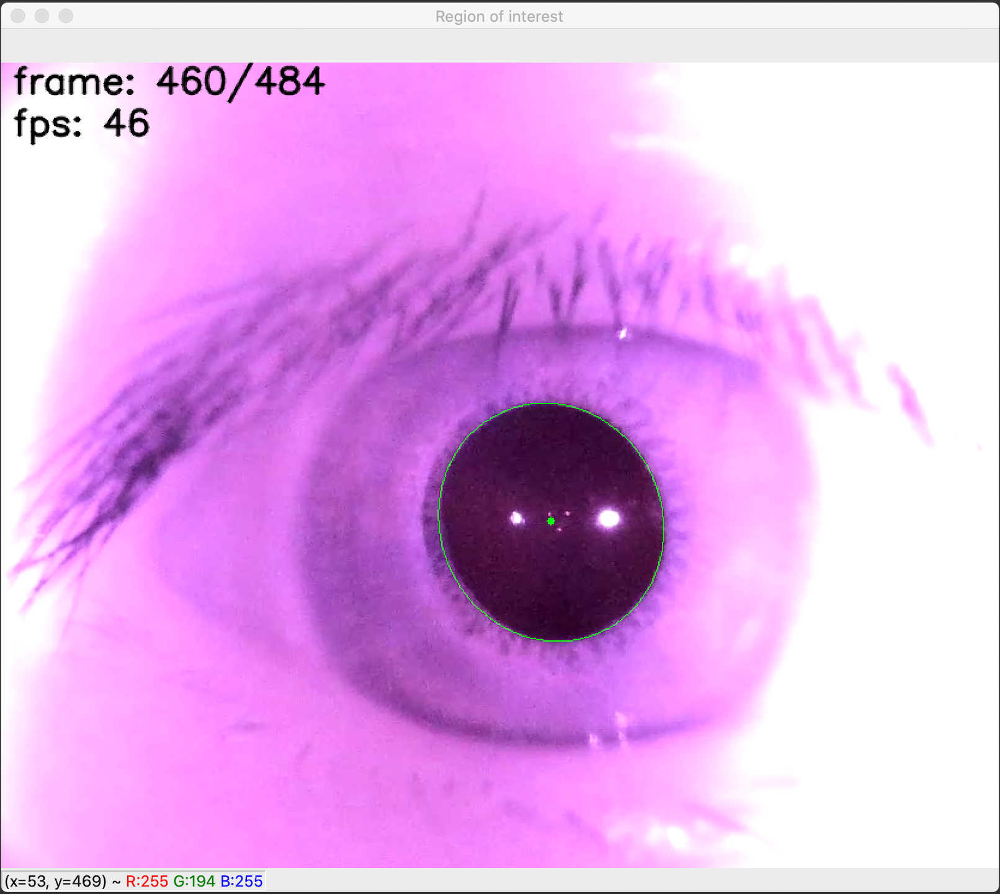

# Pupil detection algorithm challenge

This repo consists of work done as part of the TeleMedC pupil (and its centroid) detection algorithm challenge using OpenCV.

Below are a list of files in this repo and their purposes:
1. `pupil_detection.pdf` - A written explanation of my approach to solving the challenge, including image processing steps etc.
2. `pupil_detection.py` - The pupil (and its centroid) detection algorithm (file to be executed).
3. `requirements.txt` - The package dependencies to run the algorithm
4. `sample.mkv` - The video file used to develop, and to run, the algorithm on

Executing the file `pupil_detection.py` runs the algorithm on the `sample.mkv` video file provided with this repo, and will output the frames showing the estimated pupil centroid in a window titled 'Region of interest'. The controls of the frame are as follows: press key `p` to pause and resume the frame, and while the frames are running, press key `q` to quit. If you don't quit manually, the frame will close itself automatically at the end of the video. Also note that there is an overlay in the top left of the video displaying the current frame number, and the frames per second.

